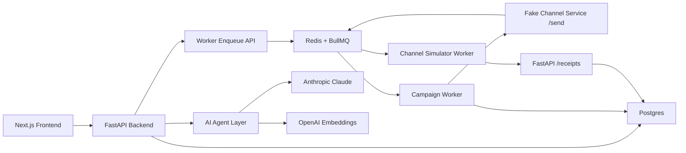

# Xeno Agentic Mini CRM

Production-style SDE take-home implementation for Xeno's Engineering Internship Assignment 2026.

This rebuild is an **approval-gated AI campaign agent** for D2C marketers. A marketer describes a campaign goal, the agent analyzes shopper and order data, proposes a segment/channel/message plan, asks for approval, then sends the campaign through a real Redis/BullMQ queue and tracks asynchronous channel callbacks.

## Architecture



## Services

- `apps/web`: Next.js frontend campaign cockpit.
- `apps/api`: FastAPI backend, SQLAlchemy models, AI agent orchestration, receipt ingestion.
- `apps/worker`: Node worker with real BullMQ queues plus a stubbed `/send` channel service that simulates provider delivery callbacks.
- `infra/docker-compose.yml`: Postgres, Redis, API, worker, and web.

## AI Features

- Campaign planning with schema-validated structured output, served through a single OpenRouter gateway (one key, swappable models: Gemini, Claude, Qwen).
- Deterministic local fallback when the model is rate-limited or the key is absent, so the planner never hard-fails and reviewers can always run the app.
- Approval-gated execution: the agent can draft campaigns but cannot send without marketer approval.
- Agent tool trace persisted in `agent_runs`.

## Deploy (Vercel + Render + RDS + Upstash)

### 1. AWS RDS (Postgres)

1. Open the [RDS console](https://console.aws.amazon.com/rds) → **Create database**.
2. Engine: **PostgreSQL** · Template: **Free tier** (db.t3.micro, 20 GB).
3. Set a DB instance identifier (`xeno`), master username (`postgres`), and a strong password.
4. Under **Connectivity**: set **Public access = Yes**, then create or choose a security group that allows inbound TCP on port **5432 from 0.0.0.0/0**.
5. Create the database — takes ~5 min.
6. From the instance's **Connectivity & security** tab, copy the endpoint. Your connection string will be:
   ```
   postgresql://postgres:<password>@<endpoint>.rds.amazonaws.com:5432/postgres
   ```

### 2. Upstash (Redis)

1. Create a free Redis database at [upstash.com](https://upstash.com).
2. Copy the **REST URL** — for BullMQ use the **Redis URL** (starts with `rediss://`).

### 3. Render (API + Worker)

1. Connect your GitHub repo at [render.com](https://render.com).
2. Click **New → Blueprint** and select `render.yaml` — Render will create both services.
3. Set env vars for each service in the Render dashboard:

**xeno-api:**
| Key | Value |
|-----|-------|
| `DATABASE_URL` | RDS connection string (`postgresql://postgres:pw@endpoint.rds.amazonaws.com:5432/postgres`) |
| `WORKER_URL` | Public URL of xeno-worker (e.g. `https://xeno-worker.onrender.com`) |
| `ANTHROPIC_API_KEY` | Your key (optional — falls back to deterministic planner) |
| `OPENAI_API_KEY` | Your key (optional — falls back to local similarity) |

**xeno-worker:**
| Key | Value |
|-----|-------|
| `DATABASE_URL` | Same RDS connection string |
| `REDIS_URL` | Upstash Redis URL (`rediss://...`) |
| `API_BASE_URL` | Public URL of xeno-api (e.g. `https://xeno-api.onrender.com`) |

### 4. Vercel (Next.js frontend)

1. Import your GitHub repo at [vercel.com](https://vercel.com/new).
2. **Set root directory to `apps/web`** (Framework will auto-detect as Next.js).
3. Add env vars:

| Key | Value |
|-----|-------|
| `NEXT_PUBLIC_API_BASE_URL` | Public URL of xeno-api (e.g. `https://xeno-api.onrender.com`) |
| `API_BASE_URL` | Same xeno-api URL (server-side fetch from route handlers) |
| `OPENROUTER_API_KEY` | OpenRouter key — powers the AI campaign planner. Get one at [openrouter.ai/keys](https://openrouter.ai/keys) |

The campaign planner defaults to `google/gemini-2.5-flash` (~$0.0005 per plan). If the model is rate-limited or the key is missing, the planner automatically degrades to a deterministic plan so the demo never breaks.

Deploy. Your frontend URL is the live product URL.

### 5. UptimeRobot (keep Render services warm)

Render free services spin down after 15 min of no traffic. UptimeRobot pings them every 5 minutes for free, preventing cold starts entirely.

1. Sign up free at [uptimerobot.com](https://uptimerobot.com).
2. Click **Add New Monitor** twice — once for each Render service:

| Monitor type | Friendly name | URL | Interval |
|---|---|---|---|
| HTTP(s) | xeno-api | `https://xeno-api.onrender.com/health` | 5 minutes |
| HTTP(s) | xeno-worker | `https://xeno-worker.onrender.com/health` | 5 minutes |

Both services expose a `/health` endpoint that returns `{"ok": true}`. UptimeRobot hitting it every 5 minutes keeps them permanently warm — no 30-second cold starts.

---

## Run Locally (Docker Compose)

```bash
cp .env.example .env
docker compose -f infra/docker-compose.yml up --build
```

Open `http://localhost:3000`. FastAPI docs at `http://localhost:8000/docs`.

## Local Test Commands

```bash
# API (Python 3.12)
cd apps/api
python3 -m venv .venv && .venv/bin/pip install -r requirements.txt -q
.venv/bin/python -m pytest tests/ -q

# Worker
bun --cwd apps/worker test
```

## Demo Flow

1. Seed customers/orders from the dashboard.
2. Open `Campaigns -> New Agent Campaign`.
3. Ask: `Win back shoppers who have not purchased in 60 days with a personalized WhatsApp or SMS offer.`
4. Review the agent plan and create a campaign draft.
5. Approve and send.
6. Watch the fake channel service callbacks update performance.

## Scale Decisions

- Postgres is the durable source of truth.
- Redis is only queue/transient infrastructure.
- BullMQ workers isolate high-volume dispatch and channel lifecycle simulation from API requests.
- The CRM calls a separate fake channel `/send` endpoint per recipient; that service returns `accepted` and later calls back with delivery and engagement receipts.
- Receipt ingestion is idempotent and preserves highest lifecycle state when events arrive out of order.
- The channel service remains stubbed as required by the assignment.
