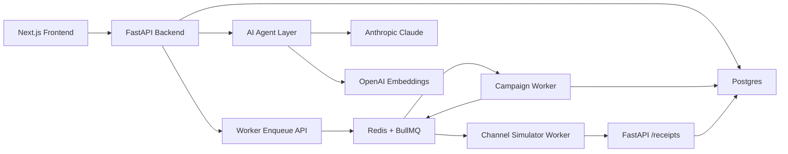

# Xeno Agentic Mini CRM

Production-style SDE take-home implementation for Xeno's Engineering Internship Assignment 2026.

This rebuild is an **approval-gated AI campaign agent** for D2C marketers. A marketer describes a campaign goal, the agent analyzes shopper and order data, proposes a segment/channel/message plan, asks for approval, then sends the campaign through a real Redis/BullMQ queue and tracks asynchronous channel callbacks.

## Architecture



## Services

- `apps/web`: Next.js frontend campaign cockpit.
- `apps/api`: FastAPI backend, SQLAlchemy models, AI agent orchestration, receipt ingestion.
- `apps/worker`: Node worker with real BullMQ queues for campaign dispatch and channel simulation.
- `infra/docker-compose.yml`: Postgres, Redis, API, worker, and web.

## AI Features

- Anthropic-first campaign planning with structured output.
- OpenAI embeddings hook for audience insight retrieval.
- Deterministic local fallback when API keys are absent, so reviewers can run the app.
- Approval-gated execution: the agent can draft campaigns but cannot send without marketer approval.
- Agent tool trace persisted in `agent_runs`.

## Run With Docker Compose

```bash
cp .env.example .env
npm install
docker compose -f infra/docker-compose.yml up --build
```

Open `http://localhost:3000`.

FastAPI docs are available at `http://localhost:8000/docs`.

## Local Test Commands

```bash
npm install
cd apps/api && python -m pip install -r requirements.txt && python -m pytest
cd ../worker && npm test
```

## Demo Flow

1. Seed customers/orders from the dashboard.
2. Open `Campaigns -> New Agent Campaign`.
3. Ask: `Win back shoppers who have not purchased in 60 days with a personalized WhatsApp or SMS offer.`
4. Review the agent plan and create a campaign draft.
5. Approve and send.
6. Watch BullMQ-backed channel callbacks update performance.

## Scale Decisions

- Postgres is the durable source of truth.
- Redis is only queue/transient infrastructure.
- BullMQ workers isolate high-volume dispatch and channel lifecycle simulation from API requests.
- Receipt ingestion is idempotent and preserves highest lifecycle state when events arrive out of order.
- The channel service remains stubbed as required by the assignment.
